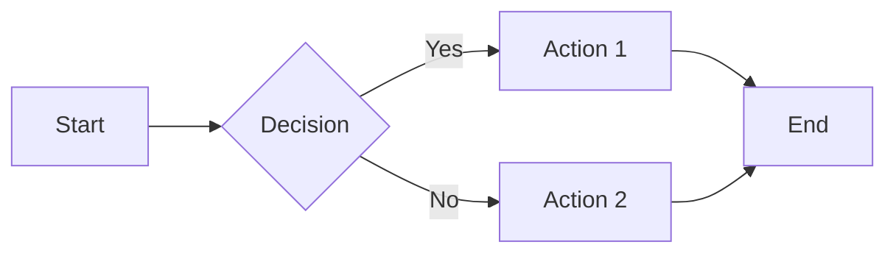

# Planning Methodology

> Structured approach to planning sprints and features.

## Planning Hierarchy

| Layer | Question | Output | When |
|-------|----------|--------|------|
| **Discovery** | What's possible? | Insights, options | When uncertain |
| **Inventory** | What exists? | Feature catalog | Start of phase |
| **Strategy** | Where going? | Vision, phases | Quarterly |
| **Sprint Goals** | What to prove? | Success criteria | Sprint planning |
| **Tasks** | How to execute? | Step-by-step | After goals set |

---

## Discovery Mode

### When to Enter
- Starting new feature area
- Hitting unknowns
- Evaluating options
- Before major decisions

### Discovery Questions
1. What's technically possible that we haven't explored?
2. What prior art exists? How have others solved this?
3. What constraints or opportunities are we blind to?
4. What knowledge exists that could unlock our approach?

### Discovery Outputs
- Insights → LESSONS.md
- Options → Document in session log
- Questions → Track in session log
- Recommendations → BACKLOG.md or sprint plan

---

## Two-Document Sprint Pattern

### Document 1: Inventory (~400 lines)

**Purpose:** Design document for human review

**Contains:**
- Problem statement
- Architecture decisions
- Schema designs
- Code sketches (not complete)
- Open questions
- Effort estimates

**Template:** `sprint-templates/SPRINT_INVENTORY_TEMPLATE.md`

### Document 2: Plan (~1600 lines)

**Purpose:** Execution instructions (copy-paste ready)

**Contains:**
- Pre-execution checklist
- Exact file paths
- Complete code
- SQL migrations
- Build verification steps
- Testing checklist

**Template:** `sprint-templates/SPRINT_PLAN_TEMPLATE.md`

### Workflow
```
1. Create Inventory
2. Review with human
3. Iterate on design (may be multiple cycles)
4. Human approves Inventory
5. Create Plan (complete code, not sketches)
6. Hand to Execution
```

---

## Sprint Planning Checklist

### Before Planning
- [ ] Read CURRENT.md (know the state)
- [ ] Read BACKLOG.md (know the queue)
- [ ] Read recent session logs
- [ ] Read LESSONS.md (recent entries)

### During Planning
- [ ] Define sprint goal (one sentence)
- [ ] Identify what's in scope
- [ ] Identify what's out of scope
- [ ] Break into phases
- [ ] Estimate effort
- [ ] Identify dependencies
- [ ] Identify risks

### After Planning
- [ ] Inventory reviewed by human
- [ ] Plan has complete code (not sketches)
- [ ] Clear handoff to Execution

---

## Output Types

| Output | Format | Hands To |
|--------|--------|----------|
| Visual/UI spec | Design brief | UX Claude |
| Workflow/Technical | Mermaid + Plan | Execution Claude |
| Discovery findings | LESSONS.md | Future reference |
| New work items | BACKLOG.md | Future sprints |

### Mermaid for Workflows

Use for state machines, sequences, data flows:



**Rule:** If Execution Claude reads it → Mermaid. If humans iterate visually → UX Claude.

---

## Handoff Patterns

### To Execution
```
"Sprint N planning complete.

Created:
- SPRINT_N_INVENTORY.md (design)
- SPRINT_N_PLAN.md (execution steps)

Sprint Goal: [one sentence]

Next: Execution project. Start with SPRINT_N_PLAN.md."
```

### To UX
```
"Design brief ready.

Created: [FEATURE]_DESIGN_SPEC.md

Design Goal: [one sentence]

Next: UX project. Create designs per spec."
```

---

## Anti-Patterns

| Anti-Pattern | Why Wrong | Do Instead |
|--------------|-----------|------------|
| Plan without Inventory | Design not reviewed | Inventory first |
| Inventory without review | No human input | Get approval |
| Sketches in Plan | Execution will improvise | Complete code |
| Tasks without goal | No success criteria | Define goal first |
| Planning without state | May contradict | Read CURRENT first |
